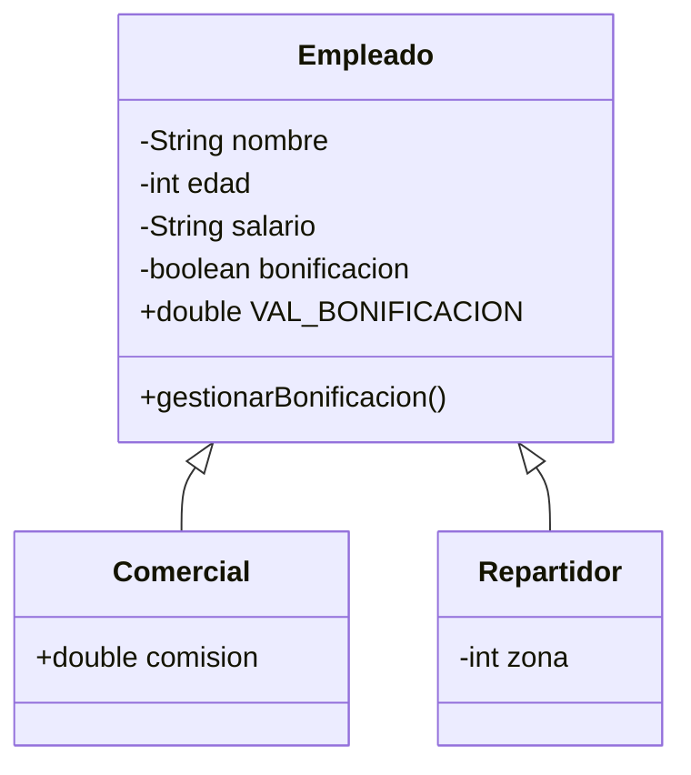

# reto_tecnico
Reto Técnico Semillero de Automatización de Pruebas V.3

Hacer un programa que permita gestionar empleados de una compañía XYZ, se debe implementar interfaz gráfica para manipular y mostrar la información. 
 Los empleados se definen por tener: 

-   ​	Nombre
-   ​	Edad
-   ​	Salario
-   ​	Bonificación por un valor de $150.000 COP  

Se tienen dos tipos de empleados: repartidor y comercial:

**El comercial,** aparte de los atributos anteriores, tiene uno más llamado comisión; si tiene más de 30 años y cobra una comisión de más de 400.000 COP, se le aplicara la bonificación. 

**El repartidor,** aparte de los atributos de empleado, tiene otro llamado zona; si tiene menos de 25 y reparte en la “zona 3”, este recibirá la bonificación

Validar y mostrar un mensaje si se aplicó la bonificación o no. 

**Condiciones:**

-   ​	No se podrán crear objetos del tipo Empleado (la clase padre) pero si de sus hijas. 
     Las clases tendrán un método para la bonificación, que según en cada clase tendrá una implementación distinta.  
-   ​	Crear diferentes escenarios donde se pueda mostrar en la interfaz gráfica la información del empleado según su rol, se debe visualizar el nombre, salario, bonificación y zona si aplica; esta información debe ser llevada a un archivo CSV
-   ​	El ejercicio esta creado para aplicar POO, Herencia y Polimorfismo

# Solución

 ## Video demostración

<iframe width="560" height="315" src="https://www.youtube.com/embed/NpEaa2P7qZI" title="YouTube video player" frameborder="0" allow="accelerometer; autoplay; clipboard-write; encrypted-media; gyroscope; picture-in-picture" allowfullscreen></iframe>

